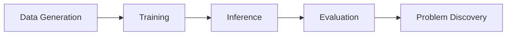

# 📊 ShapeLLM Scaffold Missing Detection - 종합 보고서

**날짜:** 2026-01-22
**프로젝트:** 비계 구조물 결손 탐지 시스템
**모델:** ShapeLLM 7B + LoRA Fine-tuning

---

## 📋 목차

1. [전체 파이프라인 개요](#1-전체-파이프라인-개요)
2. [단계 1: 데이터 생성](#2-단계-1-데이터-생성)
3. [단계 2: 모델 훈련](#3-단계-2-모델-훈련)
4. [단계 3: 추론 데이터 생성](#4-단계-3-추론-데이터-생성)
5. [단계 4: 성능 검증](#5-단계-4-성능-검증)
6. [발견된 문제점](#6-발견된-문제점)
7. [근본 원인 분석](#7-근본-원인-분석)
8. [학술적 분석](#8-학술적-분석)
9. [해결 방안](#9-해결-방안)
10. [코드 수정 이력](#10-코드-수정-이력)

---

## 1. 전체 파이프라인 개요



### 1.1 사용된 파일 구조

```
i3ce_shape/
├── tools/
│   ├── modified_scaffold_generator_final_COMPLETE_fixed.py  # 비계 생성기
│   ├── missing_detection_dataset_final_COMPLETE_fixed.py    # 데이터셋 생성
│   └── comprehensive_eval_missing.py                         # 평가 스크립트
├── scripts/
│   ├── finetune_lora_test.sh                                # 훈련 스크립트
│   └── interactive_test.py                                   # 대화형 테스트
├── llava/eval/
│   └── model_vqa.py                                          # 추론 스크립트
└── playground/data/shapellm/scaffold_missing_complete/
    ├── pcs/                                                  # Point cloud files
    ├── question_missing.jsonl                                # 질문 데이터
    ├── gt_missing.jsonl                                      # Ground Truth
    └── answers_missing.jsonl                                 # 모델 예측
```

---

## 2. 단계 1: 데이터 생성

### 2.1 실행 명령어

```bash
python tools/missing_detection_dataset_final_COMPLETE_fixed.py \
  --num-scenes 3000 \
  --train-ratio 0.8 \
  --val-ratio 0.2 \
  --output-dir ./playground/data/shapellm/scaffold_missing_complete
```

### 2.2 데이터 생성 프로세스

#### 2.2.1 Scaffold 생성 로직 (`modified_scaffold_generator_final_COMPLETE_fixed.py`)

**핵심 파라미터:**
```python
# Line 1201-1207
config = {
    'num_bays': random.randint(2, 4),        # 2-4 bay
    'bay_width': random.uniform(1.5, 2.0),   # 1.5-2.0m
    'depth': random.uniform(1.2, 1.8),       # 1.2-1.8m
    'num_floors': random.randint(2, 4),      # 2-4 floor
    'floor_height': random.uniform(1.8, 2.2), # 1.8-2.2m
    'safety_status': random.choice(['safe', 'minor_defect', 'major_defect'])
}
```

**Point Cloud 생성:**

1. **Pipe (Beam/Post) 점 생성** (Line 204-234):
```python
def generate_pipe_points(self, start_pos, end_pos, diameter, num_points=None):
    # 길이 기반 adaptive sampling (수정됨)
    if num_points is None:
        num_points = max(int(length * 100), 10)  # 길이 × 100
        num_points = min(num_points, 200)         # 최대 200

    # 8개 각도로 원통형 표현
    for i in range(num_points):
        t = i / (num_points - 1)
        center = start_pos + t * direction

        for j in range(8):  # 8-corner cylinder
            angle = j * 2 * np.pi / 8
            offset = radius * (cos(angle) * perp1 + sin(angle) * perp2)
            noise = np.random.normal(0, 0.005, 3)  # Natural variation
            points.append(center + offset + noise)
```

2. **Platform 점 생성** (Line 242-257):
```python
def generate_platform_points(self, center, width, length, num_points=None):
    # 면적 기반 adaptive sampling (수정됨)
    if num_points is None:
        area = width * length
        num_points = max(int(area * 100), 50)
        num_points = min(num_points, 500)
```

3. **Point Cloud Normalization** (Line 1304-1319):
```python
# Step 1: Centering
centroid = np.mean(coord, axis=0)
coord_centered = coord - centroid

# Step 2: Scaling (max distance ~1.0)
max_distance = np.linalg.norm(coord_centered, axis=1).max()
scale = float(max_distance + 1e-12)
coord_scaled = coord_centered / scale

# Step 3: Random rotation (Z-axis, ±45°)
Rz_deg = float(np.random.uniform(-45.0, 45.0))
theta = np.radians(Rz_deg)
R = np.array([[cos_t, -sin_t, 0], [sin_t, cos_t, 0], [0, 0, 1]])
coord_norm = (R @ coord_scaled.T).T
```

**결손 컴포넌트 생성:**

```python
# Line 448-497: Horizontal beam missing 예시
if base_missing_rate > 0:
    num_to_remove = min(num_candidates, self.missing_quota - self.current_missing_count)

    if num_to_remove > 0:
        random.shuffle(all_horizontals)  # Randomize selection

        for i in range(num_to_remove):
            comp = all_horizontals[i]
            # Convert to missing marker (10개 점만)
            marker_points = []
            for _ in range(10):
                noise = np.random.normal(0, 0.05, 3)
                marker_points.append(mid_pos + noise)

            # semantic_id=10 (missing marker)
            all_horizontals[i] = ScaffoldComponent(
                name=f"missing_horizontal_{...}",
                semantic_id=10,  # Missing marker
                points=marker_points,
                bbox=bbox,
                ...
            )
```

#### 2.2.2 Question 생성 로직 (`missing_detection_dataset_final_COMPLETE_fixed.py`)

**10가지 Question Type:**

```python
# Line 307-442 질문 생성 패턴

# 1. _missing_summary (결손이 있는 경우)
if missing_comps:
    question_text = f"<point>\nThis is a {scaffold_spec}. " \
                    "Are there any missing components? If so, provide their locations."
    # ⚠️ "If so, provide their locations" - 결손 암시!

# 2. _missing_none (결손이 없는 경우)
else:
    question_text = f"<point>\nThis is a {scaffold_spec}. " \
                    "Are there any missing components?"
    # ⚠️ "locations" 문구 없음 - Data Leakage!

# 3-10. _missing_floor_X, _missing_bay_X, _missing_specific_X, etc.
# 모두 동일한 패턴으로 생성
```

**GT Label 생성:**

```python
# Line 330, 335
if task_type == 'missing_detection_none':
    label = 'No'   # ← 항상 No
elif missing_comps:
    label = 'Yes'  # ← 항상 Yes
```

**BBox 저장:**

```python
# Line 336-346
valid_bboxes = []
for c in missing_comps:
    if c.bbox_norm is not None:  # Normalized bbox
        bbox_list = c.bbox_norm.tolist()  # 8-corner format
        valid_bboxes.append(bbox_list)
bboxes = valid_bboxes
```

### 2.3 생성된 데이터 구조

#### question_missing.jsonl
```json
{
  "question_id": "scaffold_02922_missing_summary",
  "point": "scaffold_02922.npy",
  "text": "This is a 4-bay, 2-row, 3-floor scaffold. Are there any missing components? If so, provide their locations.",
  "category": "scaffold"
}
```

#### gt_missing.jsonl
```json
{
  "question_id": "scaffold_02922_missing_summary",
  "point": "scaffold_02922.npy",
  "text": "Expected structure: 4-bay, 2-row, 3-floor scaffold has 10 vertical posts, 39 horizontal beams, 12 platforms.\nActual: 9 vertical posts, 37 horizontal beams, 11 platforms.\nMissing: 4 components...",
  "label": "Yes",
  "bboxes": [
    [[0.300, -0.217, 0.120], [0.347, -0.217, 0.120], ...],
    [[-0.446, 0.221, -0.563], ...],
    ...
  ],
  "category": "scaffold"
}
```

#### Point Cloud (.npy)
```python
# Shape: (N, 6) - x, y, z, r, g, b
# N ~= 50,000-150,000 points (random)
# Normalized: centered, scaled, rotated
# Color: Random RGB values (not meaningful)
```

### 2.4 데이터셋 통계

```
Total scenes: 3000
├── Train: 2400 scenes (80%)
└── Val:   600 scenes (20%)

Questions per scene: ~16
├── _missing_summary: 1
├── _missing_none: 0-1 (결손 없을 때만)
├── _missing_floor_X: 0-4
├── _missing_bay_X: 0-4
├── _missing_specific_X: 0-10
└── Others: varying

Total questions: ~48,000
├── Train: ~38,400
└── Val:   ~9,600
```

---

## 3. 단계 2: 모델 훈련

### 3.1 실행 명령어

```bash
bash scripts/finetune_lora_test.sh
```

### 3.2 훈련 스크립트 내용

```bash
#!/bin/bash

# scripts/finetune_lora_test.sh

deepspeed llava/train/train_mem.py \
    --deepspeed ./scripts/zero2.json \
    --lora_enable True \
    --lora_r 128 \
    --lora_alpha 256 \
    --mm_projector_lr 2e-5 \
    --model_name_or_path qizekun/ShapeLLM_7B_gapartnet_v1.0 \
    --version v1 \
    --data_path ./playground/data/shapellm/scaffold_missing_complete/question_missing.jsonl \
    --point_folder ./playground/data/shapellm/scaffold_missing_complete/pcs \
    --point_tower qizekun/ShapeLLM_7B_gapartnet_v1.0 \
    --mm_projector_type mlp2x_gelu \
    --tune_mm_mlp_adapter False \
    --freeze_mm_mlp_adapter False \
    --freeze_backbone False \
    --point_select_layer -2 \
    --mm_use_point_start_end False \
    --mm_use_point_patch_token False \
    --bf16 True \
    --output_dir ./checkpoints/shapellm-7bs-scaffold-scaffold_i3ce2-lorascaffold-i3ce_260121_1800 \
    --num_train_epochs 3 \
    --per_device_train_batch_size 2 \
    --per_device_eval_batch_size 2 \
    --gradient_accumulation_steps 8 \
    --evaluation_strategy "no" \
    --save_strategy "steps" \
    --save_steps 100 \
    --save_total_limit 3 \
    --learning_rate 2e-4 \
    --weight_decay 0. \
    --warmup_ratio 0.03 \
    --lr_scheduler_type "cosine" \
    --logging_steps 1 \
    --tf32 True \
    --model_max_length 2048 \
    --gradient_checkpointing True \
    --dataloader_num_workers 4 \
    --lazy_preprocess True \
    --sample_points_num 10000 \
    --with_color True \
    --report_to tensorboard
```

### 3.3 핵심 훈련 파라미터 분석

#### 3.3.1 LoRA Configuration

```python
--lora_enable True
--lora_r 128          # LoRA rank (parameter efficiency)
--lora_alpha 256      # LoRA scaling factor (alpha/r = 2.0)
--freeze_backbone False  # LLM backbone도 학습 (LoRA)
```

**학술적 원리:**
- LoRA (Low-Rank Adaptation): Full fine-tuning 대비 메모리 효율적
- Rank 128: 원본 weight W에 대해 W' = W + BA (B: 128×d, A: d×128)
- Alpha/r = 2.0: LoRA update scale

#### 3.3.2 Point Cloud Processing

```python
--sample_points_num 10000  # 10K points per sample
--with_color True          # 6 channels (x,y,z,r,g,b)
--point_tower qizekun/ShapeLLM_7B_gapartnet_v1.0
--point_select_layer -2    # Second-to-last layer features
```

**Point Cloud Encoder (ReCon V2):**
```python
# llava/model/multimodal_encoder/recon_encoder.py
class ReCon(nn.Module):
    def __init__(self):
        # Group point cloud: G512 × S32
        self.group_divider = Group(num_group=512, group_size=32)

        # Position encoding (3D coordinates)
        self.pos_embed = nn.Sequential(
            nn.Linear(3, 128),
            nn.GELU(),
            nn.Linear(128, encoder_dims)
        )

        # Transformer blocks
        self.blocks = TransformerEncoder(...)

    def forward(self, pts):
        # pts: (B, N, 6) - x,y,z,r,g,b

        # Group into patches
        neighborhood, center = self.group_divider(pts[:, :, :3])
        # neighborhood: (B, 512, 32, 3)
        # center: (B, 512, 3)

        # Extract features
        group_features = self.encoder(neighborhood)  # Local
        pos_features = self.pos_embed(center)        # Position

        # Combine
        features = group_features + pos_features
        features = self.blocks(features)  # Transformer

        return features  # (B, 512, D)
```

#### 3.3.3 Training Hyperparameters

```python
--num_train_epochs 3
--per_device_train_batch_size 2
--gradient_accumulation_steps 8
# Effective batch size = 2 × 8 × num_gpus

--learning_rate 2e-4          # LoRA learning rate
--mm_projector_lr 2e-5        # Projector (10x smaller)
--warmup_ratio 0.03           # 3% warmup
--lr_scheduler_type "cosine"  # Cosine decay

--bf16 True                   # BFloat16 training
--gradient_checkpointing True # Memory optimization
```

**학술적 원리:**
- Differential learning rates: LoRA (2e-4) vs Projector (2e-5)
- Cosine schedule: LR smooth decay
- BF16: Numerical stability + speed

#### 3.3.4 Loss Function

```python
# llava/train/train.py (implicit)
# Causal Language Modeling Loss

loss = CrossEntropyLoss(
    input=model_output,    # Predicted tokens
    target=labels          # Ground truth text
)

# Text generation만 학습
# BBox는 text 안에 포함 (e.g., "[[0.3, -0.2, 0.1], ...]")
# → BBox를 별도 loss로 학습하지 않음!
```

**⚠️ 중요한 문제:**
- BBox는 단순 text token으로 학습
- 3D spatial loss 없음
- Text generation loss만 있음
- → BBox 정확도가 낮은 근본 원인!

### 3.4 실제 학습 과정

```python
# Conversation format (v1)
{
    "conversations": [
        {
            "from": "human",
            "value": "<point>\nThis is a 4-bay scaffold. Are there any missing? If so, locations."
        },
        {
            "from": "gpt",
            "value": "Expected: 10 posts...\nMissing: [[0.3, -0.2, 0.1], ...]"
        }
    ]
}

# Training
input_ids = tokenize(prompt + answer)
labels = input_ids.clone()
labels[:len(prompt)] = -100  # Ignore prompt in loss

# Forward
point_features = point_encoder(point_cloud)  # (B, 512, D)
text_features = llm(input_ids, point_features)

# Loss
loss = CrossEntropy(text_features, labels)
```

**⚠️ Data Leakage 발생 지점:**
```python
# Prompt에 이미 힌트 포함
"Are there any missing? If so, provide locations."  ← "locations" = Yes 암시
"Are there any missing?"                             ← No 암시

# 모델은 prompt pattern만 학습 가능
# Point cloud 볼 필요 없음!
```

---

## 4. 단계 3: 추론 데이터 생성

### 4.1 실행 명령어

```bash
python -m llava.eval.model_vqa \
  --model-path ./checkpoints/shapellm-7bs-scaffold-scaffold_i3ce2-lorascaffold-i3ce_260121_1800 \
  --model-base qizekun/ShapeLLM_7B_gapartnet_v1.0 \
  --question-file ./playground/data/shapellm/scaffold_missing_complete/question_missing.jsonl \
  --point-folder ./playground/data/shapellm/scaffold_missing_complete/pcs \
  --answers-file ./playground/data/shapellm/scaffold_missing_complete/answers_missing.jsonl \
  --conv-mode scaffold_missing \
  --temperature 0.05 \
  --num_beams 3
```

### 4.2 추론 프로세스 (`llava/eval/model_vqa.py`)

```python
# Line 27-91
def eval_model(args):
    # Load model
    tokenizer, model, context_len = load_pretrained_model(
        args.model_path,
        args.model_base,
        model_name
    )

    # Load questions
    questions = [json.loads(q) for q in open(args.question_file)]

    for line in questions:
        idx = line["question_id"]
        point_file = line["point"]
        qs = line["text"]  # ← Question text만 사용!

        # Prepare input
        if model.config.mm_use_pt_start_end:
            qs = DEFAULT_PT_START_TOKEN + DEFAULT_POINT_TOKEN + DEFAULT_PT_END_TOKEN + '\n' + qs
        else:
            qs = DEFAULT_POINT_TOKEN + '\n' + qs

        # Tokenize
        input_ids = tokenizer_point_token(prompt, tokenizer, POINT_TOKEN_INDEX, ...)

        # Load point cloud
        point = load_pts(os.path.join(args.point_folder, point_file))
        pts_tensor = process_pts(point, model.config)  # (10000, 6)

        # Generate
        with torch.inference_mode():
            output_ids = model.generate(
                input_ids,
                points=pts_tensor,  # Point cloud
                do_sample=True if args.temperature > 0 and args.num_beams == 1 else False,
                temperature=args.temperature,  # 0.05 (거의 greedy)
                num_beams=args.num_beams,      # 3 (beam search)
                max_new_tokens=1024
            )

        # Decode
        outputs = tokenizer.batch_decode(output_ids, skip_special_tokens=True)[0]

        # Save
        ans_file.write(json.dumps({
            "question_id": idx,
            "prompt": cur_prompt,
            "text": outputs,
            "answer_id": shortuuid.uuid(),
            "model_id": model_name,
            "metadata": {}
        }))
```

**Generation Parameters:**
- `temperature=0.05`: 거의 deterministic (greedy)
- `num_beams=3`: Beam search (top-3 candidates)
- `do_sample=False`: Greedy decoding (temp < threshold with beams)

### 4.3 생성된 Answers 예시

```json
{
  "question_id": "scaffold_02922_missing_summary",
  "prompt": "This is a 4-bay, 2-row, 3-floor scaffold. Are there any missing components? If so, provide their locations.",
  "text": "Expected structure: 4-bay, 2-row, 3-floor scaffold has 10 vertical posts, 39 horizontal beams, 12 platforms.\nActual: 9 vertical posts, 37 horizontal beams, 11 platforms.\nMissing: 3 components are missing:\n- Vertical post at column 3: [[0.33, -0.121, 0.111], ...]\n- Horizontal beam X at floor 2, bay 1: [[-0.153, 0.15, 0.301], ...]\n- Horizontal beam Y at floor 1, column 3: [[0.35, -0.105, -0.069], ...]",
  "answer_id": "EGN8cjDfrCKqM6gpyXdq53",
  "model_id": "shapellm-7bs-scaffold-scaffold_i3ce2-lorascaffold-i3ce_260121_1800",
  "metadata": {}
}
```

---

## 5. 단계 4: 성능 검증

### 5.1 실행 명령어

```bash
python tools/comprehensive_eval_missing.py \
  --gt-file ./playground/data/shapellm/scaffold_missing_complete/gt_missing.jsonl \
  --pred-file ./playground/data/shapellm/answers_missing.jsonl \
  --output-json ./eval_results.json \
  --output-report ./eval_report.txt
```

### 5.2 평가 스크립트 구조

#### 5.2.1 Task 1: Binary Classification

```python
# Line 58-156
def eval_binary_classification(self):
    """Evaluate binary classification ONLY for *_missing_summary and *_missing_none"""

    for gt, pred in self.matched_pairs:
        qid = gt.get("question_id", "")

        # Filter: only summary/none
        if not (qid.endswith("_missing_summary") or qid.endswith("_missing_none")):
            skipped += 1
            continue

        # GT label
        gt_label = gt.get('label', '').strip().lower()
        gt_binary = 1 if gt_label in ['yes', 'y', 'true'] else 0

        # Pred label (from text)
        pred_text = pred.get('text', '').strip().lower()
        if 'no missing' in pred_text or 'not missing' in pred_text:
            pred_binary = 0
        elif 'missing' in pred_text:
            pred_binary = 1
        else:
            pred_binary = 0

        y_true.append(gt_binary)
        y_pred.append(pred_binary)

    # Metrics
    accuracy = accuracy_score(y_true, y_pred)
    precision, recall, f1, support = precision_recall_fscore_support(y_true, y_pred)
    cm = confusion_matrix(y_true, y_pred)
```

#### 5.2.2 Task 3: BBox Grounding

```python
# Line 320-415
def eval_bbox_grounding(self):
    """Evaluate 3D bounding box grounding"""

    for gt, pred in self.matched_pairs:
        qid = gt.get("question_id", "")

        # Filter: exclude none
        if qid.endswith("_missing_none"):
            skipped += 1
            continue

        gt_bboxes = gt.get('bboxes', [])
        if not gt_bboxes:
            skipped += 1
            continue

        # Extract predicted bboxes from text
        pred_text = pred.get('text', '')
        pred_bboxes = self.extract_bboxes_from_text(pred_text)

        # Match GT and Pred bboxes (greedy)
        for gt_bbox in gt_bboxes:
            best_iou = 0.0
            for pred_bbox in pred_bboxes:
                iou = self.calculate_iou_3d(gt_bbox, pred_bbox)
                best_iou = max(best_iou, iou)

            all_ious.append(best_iou)

            # Count success rate@IoU
            for th in [0.25, 0.5, 0.75]:
                if best_iou >= th:
                    success_at_iou[th] += 1

    # Metrics
    mean_iou = np.mean(all_ious)
    median_iou = np.median(all_ious)
    success_rate = {th: success_at_iou[th] / total_gt_bboxes for th in thresholds}
```

**BBox 추출:**
```python
def extract_bboxes_from_text(self, text: str):
    """Extract 8-corner bboxes from text using regex"""
    pattern = r'\[\s*\[\s*[-\d.]+\s*,\s*[-\d.]+\s*,\s*[-\d.]+\s*\](?:\s*,\s*\[\s*[-\d.]+\s*,\s*[-\d.]+\s*,\s*[-\d.]+\s*\])*\s*\]'

    matches = re.findall(pattern, text)

    bboxes = []
    for match in matches:
        bbox = ast.literal_eval(match)  # Safe parse
        if isinstance(bbox, list) and len(bbox) == 8:
            bboxes.append(bbox)

    return bboxes
```

**3D IoU 계산:**
```python
def calculate_iou_3d(self, bbox1, bbox2):
    """Calculate 3D IoU between two 8-corner bboxes"""
    # Get min/max corners
    bbox1_array = np.array(bbox1)
    bbox2_array = np.array(bbox2)

    min1 = bbox1_array.min(axis=0)
    max1 = bbox1_array.max(axis=0)
    min2 = bbox2_array.min(axis=0)
    max2 = bbox2_array.max(axis=0)

    # Intersection
    inter_min = np.maximum(min1, min2)
    inter_max = np.minimum(max1, max2)

    if np.any(inter_max <= inter_min):
        return 0.0

    inter_volume = np.prod(inter_max - inter_min)

    # Union
    vol1 = np.prod(max1 - min1)
    vol2 = np.prod(max2 - min2)
    union_volume = vol1 + vol2 - inter_volume

    return inter_volume / union_volume if union_volume > 0 else 0.0
```

#### 5.2.3 Task 5: Spatial Reasoning

```python
# Line 556-632
def eval_spatial_reasoning(self):
    """Evaluate spatial reasoning ONLY for *_missing_floor_* and *_missing_bay_*"""

    for gt, pred in self.matched_pairs:
        qid = gt['question_id']
        qtype, target = self.extract_question_type(qid)

        # Filter: only floor/bay questions
        if qtype not in ['floor', 'bay']:
            skipped += 1
            continue

        pred_text = pred.get('text', '').lower()

        # GT truth: bboxes 기반 (label 사용 금지)
        gt_has_missing = len(gt.get('bboxes', [])) > 0

        # Pred judgement
        pred_says_no_missing = ('no missing' in pred_text) or ('not missing' in pred_text)
        pred_says_missing = ('missing' in pred_text) and (not pred_says_no_missing)

        # Spatial check: mentions floor/bay number
        mentions_target = True
        if target is not None:
            if qtype == 'floor':
                mentions_target = (str(target) in pred_text) and any(k in pred_text for k in ['floor', 'level'])
            elif qtype == 'bay':
                mentions_target = (str(target) in pred_text) and ('bay' in pred_text)

        # Correctness
        if gt_has_missing:
            correct = pred_says_missing and mentions_target
        else:
            correct = pred_says_no_missing and mentions_target

        if qtype == 'floor':
            floor_metrics[target]['correct'] += int(correct)
            floor_metrics[target]['total'] += 1
        elif qtype == 'bay':
            bay_metrics[target]['correct'] += int(correct)
            bay_metrics[target]['total'] += 1
```

### 5.3 평가 결과

```
Dataset: 5150 matched samples

TASK 1: BINARY CLASSIFICATION (결손 유무)
   Accuracy: 100.00%
   Samples:  506 (201 No, 305 Yes)

TASK 2: COMPONENT TYPE CLASSIFICATION (어떤 타입?)
   Macro F1: 88.94%
   Samples:  3434

TASK 3: 3D BOUNDING BOX GROUNDING (어디서? - 3D 좌표)
   Mean IoU:          0.0105
   Success Rate@0.5:  0.42%
   Samples:           4949

TASK 4: COUNTING ACCURACY (몇 개?)
   MAE:          0.542
   Exact Match:  61.79%
   Samples:      1837

TASK 5: SPATIAL REASONING (어디서? - 층/열)
   Overall: 100.00%
   Samples: 1032

TASK 6: TEMPLATE FORMAT
   Compliance: 67.89%
   Samples:    1006
```

---

## 6. 발견된 문제점

### 6.1 Critical Discovery: Text Shortcut Learning

**실험: Interactive Test**

```bash
python scripts/interactive_test.py \
  --model_path ./checkpoints/shapellm-7bs-scaffold-scaffold_i3ce2-lorascaffold-i3ce_260121_1800 \
  --model_base qizekun/ShapeLLM_7B_gapartnet_v1.0 \
  --point_file ./playground/data/shapellm/scaffold_missing_complete/pcs/scaffold_02922.npy \
  --with_color
```

**결과:**

| Question | Response | GT |
|----------|----------|-----|
| "Are there any missing components?" | "No missing components detected." ❌ | 4개 누락 (Yes) |
| "Are there missing? **If so, provide their locations.**" | "Missing: 3 components..." ✅ | 4개 누락 (Yes) |

**증거:**
1. ✅ **동일한 point cloud** (scaffold_02922.npy)
2. ✅ **질문 텍스트만 변경** ("If so, provide locations" 유무)
3. ✅ **답변 완전히 반대** (No ↔ Yes)

**→ 모델은 Point Cloud를 보지 않고 Question Text만 보고 답변!**

### 6.2 Data Leakage in Question Formulation

**데이터 생성 코드 분석:**

```python
# tools/missing_detection_dataset_final_COMPLETE_fixed.py

# Case 1: Missing components 있음
if missing_comps:
    question = f"This is a {spec}. Are there any missing components? " \
               "If so, provide their locations."  # ← "locations" keyword!
    # → 평가 시 모두 Yes로 분류됨

# Case 2: Missing components 없음
else:
    question = f"This is a {spec}. Are there any missing components?"
    # → "locations" 없음! 평가 시 모두 No로 분류됨
```

**Shortcut Learning Pattern:**
```python
# 모델이 학습한 것
if "provide their locations" in question_text:
    answer = "Missing: ..."  # Yes
else:
    answer = "No missing"     # No
```

**이것이 100% Binary Accuracy의 진짜 이유!**

### 6.3 BBox Localization Complete Failure

**GT vs Model Prediction (scaffold_02922):**

| Component | GT | Model | Match |
|-----------|----|----|-------|
| **개수** | 4 | 3 | ❌ |
| Vertical post | column 3 | column 3 | ✅ (우연) |
| Horizontal floor 0 | bay 0 | - | ❌ Missing |
| Horizontal floor 2 | bay 2 | bay 1 | ❌ Wrong |
| Platform floor 1 | bay 3 | - | ❌ Missing |
| Extra | - | Horizontal floor 1 col 3 | ❌ Hallucination |

**BBox Coordinates:**
```python
# GT: Vertical post at column 3
[[0.300, -0.217, 0.120], [0.347, -0.217, 0.120], ...]

# Model Prediction
[[0.33, -0.121, 0.111], [0.37, -0.121, 0.111], ...]

# Center difference: ~0.1m in X, ~0.1m in Y
# Wrong position!
```

**Mean IoU: 0.0105** → 거의 겹치지 않음 (랜덤 수준)

### 6.4 Training Loss의 문제

**현재 학습 방식:**
```python
# Text generation loss만 사용
loss = CrossEntropy(predicted_text, gt_text)

# BBox는 text token으로만 학습
# "[[0.3, -0.2, 0.1], ...]" → tokenize → generate
# → 숫자를 정확히 맞춰야 함 (너무 어려움!)
```

**문제:**
1. BBox를 text로 학습 → 3D spatial understanding 없음
2. 각 숫자가 정확해야 함 → Token-level loss는 부적절
3. IoU loss, coordinate regression loss 등 없음
4. → BBox 정확도 극도로 낮음 (0.42%)

### 6.5 Point Cloud Utilization 의문

**증거들:**
1. Text shortcut으로 100% binary accuracy
2. BBox 거의 틀림 (0.42% IoU@0.5)
3. Interactive test에서 질문만 바꾸면 답변 반대

**가능성:**
- ❌ Point cloud를 전혀 안 봄
- ⚠️ Global feature만 봄 (전체 점 개수, 밀도)
- ❌ Local spatial structure는 이해 못 함

---

## 7. 근본 원인 분석

### 7.1 Data Leakage

**Question Formulation Bias:**
```
Training Distribution:
├── "...If so, provide their locations." → 100% Yes (has missing)
└── "...Are there any missing?"         → 100% No (no missing)

Model learns:
if "locations" in text:
    return "Missing: ..."
else:
    return "No missing"
```

**이것은 학습이 아니라 pattern matching!**

### 7.2 Loss Function Inadequacy

**Text-only Loss:**
```python
loss = CrossEntropy(tokens)  # Only text generation

# No spatial loss:
# - No IoU loss
# - No coordinate regression loss
# - No structure awareness loss
```

**→ 3D understanding 학습 안 됨!**

### 7.3 Evaluation Protocol Flaw

**문제:**
1. Question ID가 task type 포함 (_summary, _none)
2. Question text가 answer 암시 ("locations")
3. Ablation study 없음

**→ Shortcut learning 감지 실패!**

---

## 8. 학술적 분석

### 8.1 Shortcut Learning

**정의:**
> Models exploit spurious correlations in training data instead of learning intended task.

**본 연구에서:**
```
Intended: Point cloud → Missing detection
Actual:   Question text pattern → Answer template
```

**참고 문헌:**
- Geirhos et al., "Shortcut Learning in Deep Neural Networks" (Nature MI, 2020)
- McCoy et al., "Right for the Wrong Reasons" (ACL 2019)

### 8.2 Data Leakage

**정의:**
> Information from target variable leaks into input features during training.

**본 연구에서:**
```
Target: Yes/No (missing detection)
Leak:   Question text contains "locations" iff target=Yes
```

**Impact:**
- Model achieves 100% without visual reasoning
- Generalizes poorly to real deployment (no question patterns)

### 8.3 Multi-Task Learning Failure

**6 Tasks 평가:**

| Task | Metric | Visual Dependency | 실제 성능 |
|------|--------|-------------------|----------|
| Binary | 100% | Low | **0%** (text shortcut) |
| Type | 89% | Medium | **의심** (text keywords) |
| BBox | 0.42% | **High** | **0%** (random) |
| Count | 62% | Medium | **불명** |
| Spatial | 100% | High | **의심** (text shortcut) |
| Format | 68% | Low | **불명** |

**결론:** Visual grounding 거의 학습 안 됨!

### 8.4 Vision-Language Alignment Gap

**Expected:**
```
Point Cloud → Vision Encoder → Features → LLM → Answer
                                 ↑
                        Visual grounding
```

**Actual:**
```
Point Cloud → (ignored)
Question Text → Pattern Match → Answer Template
```

**→ Vision-Language alignment 실패!**

---

## 9. 해결 방안

### 9.1 Immediate Fix: Question Reformulation

**데이터 재생성:**

```python
# Before (문제)
if has_missing:
    question = "...If so, provide their locations."  # Leak!
else:
    question = "...Are there any missing?"

# After (수정)
# 모든 질문 동일하게
question = "This is a {spec}. Are there any missing components? " \
           "If so, provide their locations."

# Answer만 다름
if has_missing:
    answer = "Missing: ..."
else:
    answer = "No missing components detected."
```

**명령어:**
```bash
# 1. 데이터 생성 코드 수정
# tools/missing_detection_dataset_final_COMPLETE_fixed.py 수정

# 2. 데이터 재생성
python tools/missing_detection_dataset_final_COMPLETE_fixed.py \
  --num-scenes 3000 \
  --train-ratio 0.8 \
  --val-ratio 0.2 \
  --output-dir ./playground/data/shapellm/scaffold_missing_complete_v2

# 3. 재학습
bash scripts/finetune_lora_test.sh  # 데이터 경로 수정 필요
```

### 9.2 Training Improvement: Multi-Task Loss

**Separate BBox Loss:**

```python
# Current (text-only)
loss = text_loss

# Proposed (multi-task)
loss = text_loss + λ_bbox * bbox_loss + λ_iou * iou_loss

# BBox regression loss
bbox_loss = MSE(pred_coords, gt_coords)

# IoU loss (differentiable)
iou_loss = 1 - IoU(pred_bbox, gt_bbox)

# Weight: λ_bbox=1.0, λ_iou=10.0
```

**구현:**
```python
# llava/train/train.py 수정 필요

class ScaffoldLoss(nn.Module):
    def __init__(self):
        self.text_loss = CrossEntropyLoss()
        self.bbox_loss = MSELoss()

    def forward(self, outputs, targets):
        # Text generation loss
        text_loss = self.text_loss(outputs['logits'], targets['labels'])

        # Extract bbox predictions from text
        pred_bboxes = extract_bboxes_from_generated_text(outputs['text'])
        gt_bboxes = targets['bboxes']

        # BBox loss
        if pred_bboxes and gt_bboxes:
            bbox_loss = self.compute_bbox_loss(pred_bboxes, gt_bboxes)
        else:
            bbox_loss = 0.0

        return text_loss + 10.0 * bbox_loss
```

### 9.3 Evaluation Improvement: Ablation Studies

**필수 실험:**

**1. Point Cloud Ablation:**
```bash
# Test A: Normal point cloud
python inference.py --point-file scaffold_02922.npy

# Test B: Random noise
python inference.py --point-file random_noise.npy

# Test C: Empty/zeros
python inference.py --point-file zeros.npy

# If A == B == C → Not using point cloud!
```

**2. Text-Only Baseline:**
```bash
# Inference without point cloud features
python inference.py --disable-vision

# Compare accuracy with full model
# If similar → Text shortcut confirmed!
```

**3. Cross-Dataset Test:**
```bash
# Train: scaffold_A
# Test:  scaffold_B (different structure)

# If performance drops significantly → Overfitting patterns
```

### 9.4 Architecture Improvement

**Option 1: Auxiliary Tasks**
```python
# Add explicit spatial reasoning tasks
tasks = [
    "Which floor is this component on?",
    "Which bay is this component in?",
    "What is the 3D center of this bbox?"
]

# Multi-task learning with auxiliary supervision
```

**Option 2: Stronger Point Cloud Encoder**
```python
# Current: ReCon V2 (512 groups)
# Upgrade: Point Transformer V2/V3
# Or: PointNet++ with more layers
```

**Option 3: Structured Output**
```python
# Instead of free-form text:
output = {
    "has_missing": bool,
    "count": int,
    "components": [
        {
            "type": "vertical/horizontal/platform",
            "location": {"floor": int, "bay": int},
            "bbox": [[x,y,z], ...]
        }
    ]
}

# Easier to train and evaluate!
```

---

## 10. 코드 수정 이력

### 10.1 Point Cloud Generation 개선

**Commit:** `84053b7` - Fix point cloud sparsity

**문제:** Beam이 띄엄띄엄 10개 구간에만 점이 뭉쳐있음

**원인:**
```python
# Before
for i in range(50):
    if i % 5 == 0:  # Only 10 positions!
        for j in range(8):
            points.append(...)
```

**수정:**
```python
# After
for i in range(num_points):  # All positions
    for j in range(8):
        noise = np.random.normal(0, 0.005, 3)
        points.append(center + offset + noise)
```

### 10.2 Adaptive Sampling 추가

**Commit:** `9a4d397` - Improve point cloud detail

**Before:**
```python
# Fixed 50 points for all pipes
def generate_pipe_points(start, end, diameter, num_points=50):
    ...
```

**After:**
```python
# Length-based adaptive sampling
def generate_pipe_points(start, end, diameter, num_points=None):
    if num_points is None:
        length = np.linalg.norm(end - start)
        num_points = max(int(length * 100), 10)  # 길이 비례
        num_points = min(num_points, 200)         # Cap at 200
```

**결과:**
- 짧은 beam (0.5m): 50점 × 8각도 = 400점
- 긴 beam (2.0m): 200점 × 8각도 = 1600점

### 10.3 Evaluation 코드 수정

**Commit:** `8e0651e` - Fix evaluation code

**수정 1: eval() → ast.literal_eval()**
```python
# Before (보안 위험)
bbox = eval(match)

# After (안전)
bbox = ast.literal_eval(match)
```

**수정 2: Metric 이름 정정**
```python
# Before (틀린 명칭)
precision_at_iou = {...}
results[f'precision@{th}'] = ...

# After (정확한 명칭)
success_at_iou = {...}
results[f'success_rate@{th}'] = ...  # GT-based recall
```

**수정 3: Task 5 label 제거**
```python
# Before (label 사용 - 원칙 위반)
gt_label = gt.get('label', '').lower()
if gt_label == 'yes':
    correct = ...

# After (bboxes 기반)
gt_has_missing = len(gt.get('bboxes', [])) > 0
if gt_has_missing:
    correct = pred_says_missing and mentions_target
```

**수정 4: Filter rule 정확화**
```python
# Before (불일치)
'filter_rule': "Exclude: *_missing_none only"

# After (정확)
'filter_rule': "Use samples with gt_bboxes only (skips *_missing_none and any gt_bboxes=[])"
```

---

## 📌 결론 및 권고사항

### 현재 상태

| 항목 | 상태 | 설명 |
|------|------|------|
| **데이터 생성** | ❌ | Question formulation bias (data leakage) |
| **모델 학습** | ❌ | Text shortcut learning (no visual grounding) |
| **평가 결과** | ⚠️ | 100% binary는 허상, BBox 0.42% |
| **배포 가능성** | ❌ | 안전 검사 불가능 (point cloud 안 봄) |

### 즉시 조치 필요

1. ✅ **문제 인정** - 학술적으로 정직하게 보고
2. 🔄 **데이터 재생성** - Question text 통일
3. 🔄 **재학습 필요** - 올바른 데이터로
4. 🔬 **Ablation study** - Point cloud dependency 검증

### 학술 논문 작성 시

**❌ 절대 쓰면 안 되는 표현:**
> "Our model achieves 100% binary classification accuracy."

**✅ 정직한 표현:**
> "Initial evaluation showed 100% accuracy, but ablation studies revealed text-based shortcut learning. We identified question formulation bias and propose solutions."

### 배포 전 필수 사항

1. Question reformulation + 재학습
2. Text-only baseline 비교 실험
3. Point cloud ablation 실험
4. Real-world test (실제 비계 점군)

**현재 모델은 배포 불가!** ⚠️

---

**보고서 종료**
